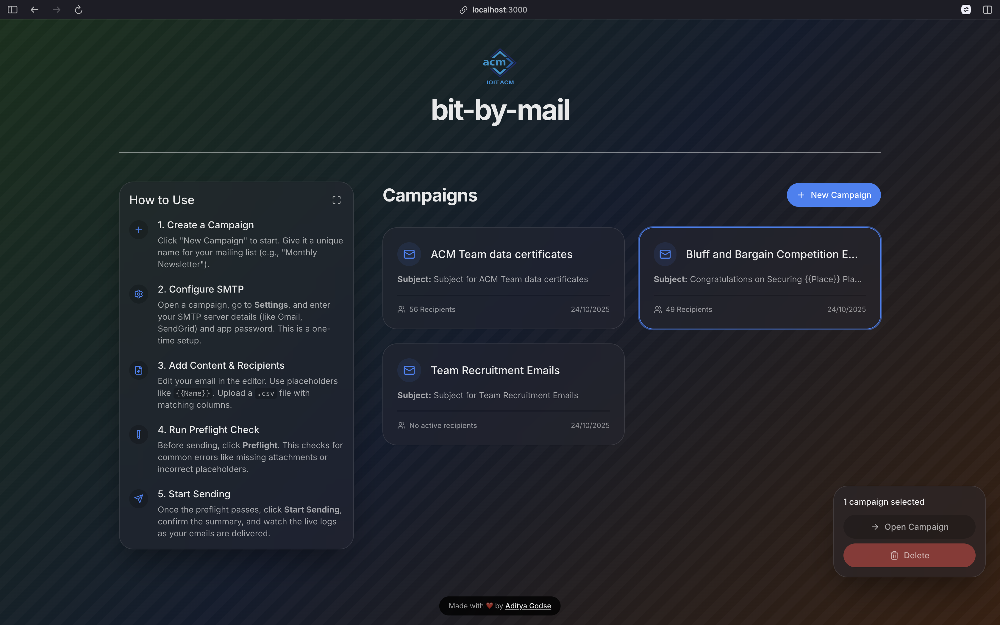
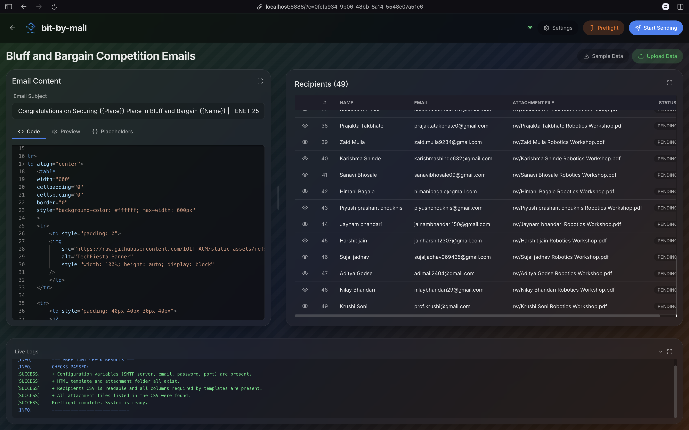
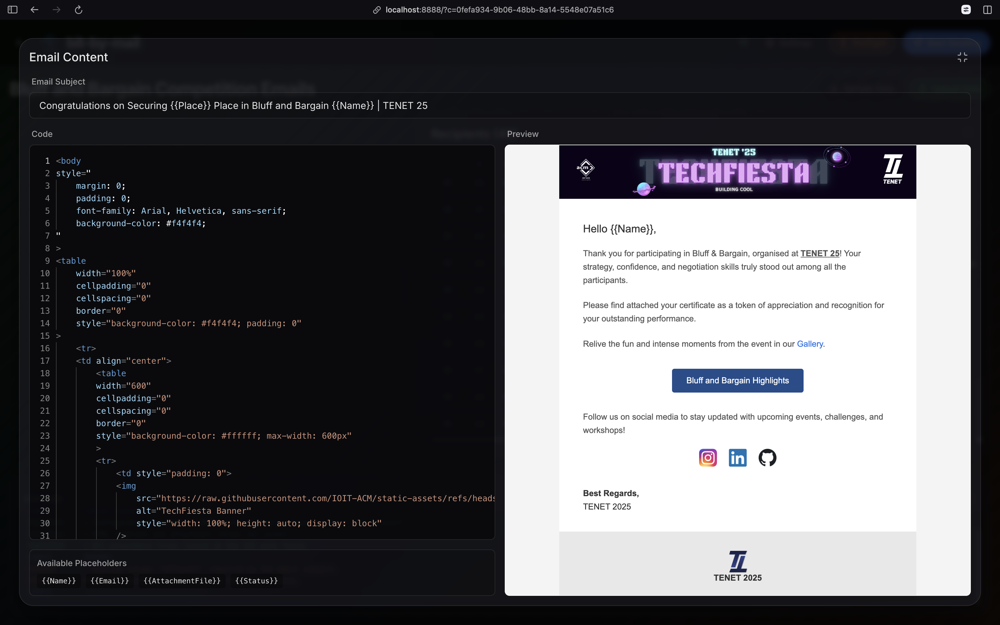
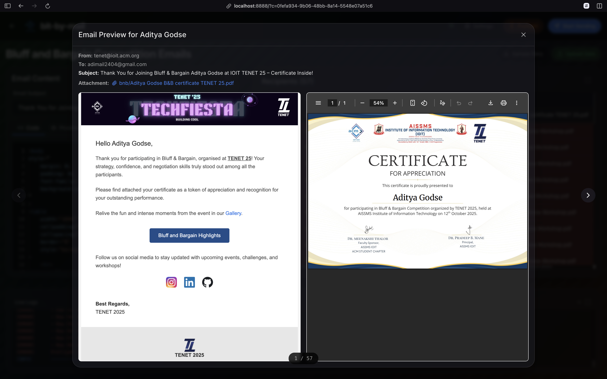
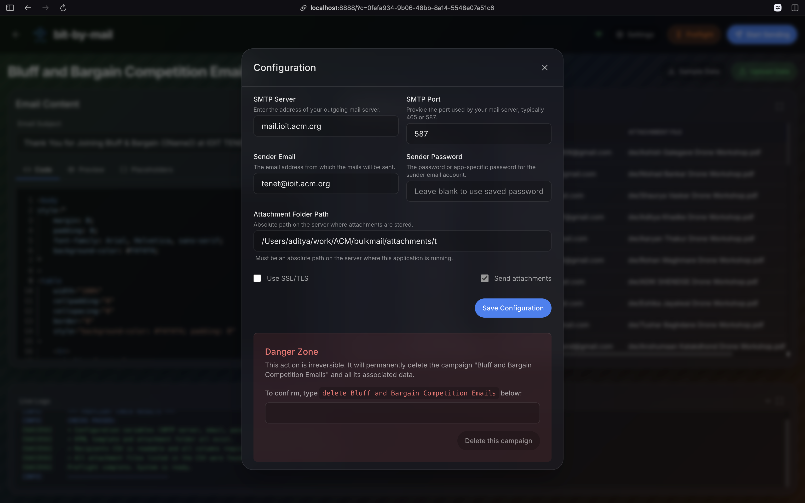

# bit-by-mail

A simple, self-hosted bulk mailing application with a web-based UI for sending personalized emails with attachments.

## Features

- **Campaign Management:** Create and manage multiple, separate email campaigns.
- **Web-Based UI:** A modern, responsive interface for all operations.
- **Rich Text Editor:** An integrated Monaco editor for writing HTML emails with a live preview.
- **Dynamic Personalization:** Use placeholders (e.g., `{{Name}}`) in the subject and body to send personalized emails.
- **Bulk Attachments:** Send a unique attachment to each recipient.
- **CSV Recipient Management:** Easily upload and manage recipients via a `.csv` file.
- **Live Progress Tracking:** Monitor the sending process in real-time with live logs and a progress bar.
- **Preflight Checks:** Run checks before sending to validate configuration, find missing attachments, and verify placeholders.
- **Self-Hosted:** Keep your data private and avoid monthly fees from email marketing services.

## Prerequisites

- Python 3.9+
- Node.js 16+ and npm

## Setup and Installation

1.  **Create the environment file:**
    Copy the example environment file:

    ```bash
    cp .env.example .env
    ```

2.  **Generate a Secret Key:**
    Run the following command to generate a secure encryption key:

    ```bash
    python -c "from cryptography.fernet import Fernet; print(Fernet.generate_key().decode())"
    ```

    Copy the output and paste it into your `.env` file as the value for `SECRET_KEY`.

    ```
    # .env
    SECRET_KEY=your-generated-key-here
    ```

3.  **Install dependencies:**
    This command will set up a Python virtual environment, install backend dependencies, and install frontend dependencies.
    ```bash
    make install
    ```

## Running the Application

### Easiest Way to Start

For the first time running the app, you can use a single command that installs all dependencies, builds the frontend, and starts the server:

```bash
make start
```

The application will be available at `http://localhost:8888`.

---

### Production Mode

This command will first build the frontend assets and then start the backend server.

```bash
make run
```

The application will be available at `http://localhost:8888`.

### Development Mode

To run the frontend and backend servers separately for development with hot-reloading:

1.  **Start the backend server:**

    ```bash
    . venv/bin/activate
    python run.py
    ```

2.  **In a new terminal, start the frontend dev server:**

    ```bash
    cd frontend
    npm run dev
    ```

    The frontend will be available at `http://localhost:3000`. It connects directly to the backend server's WebSocket on port `8888` for live updates.

## Configuration

All configuration is done through the web UI after starting the application.

1.  Click the **Settings** button.
2.  Fill in your SMTP server details, sender email, and password.
3.  Specify the path to the folder containing your attachments. This can be an absolute path or a path relative to the project root (e.g., `attachments/`, which is the default).
4.  Save the configuration.

## Recipient Data Format

Your `recipients.csv` file should have the following columns. You can upload this file via the UI.

- `Name`: The recipient's name.
- `Email`: The recipient's email address.
- `AttachmentFile`: The filename of the attachment for this recipient (must exist in your configured attachment folder).
- `Status`: The initial status, typically `PENDING`.

Any other columns you add can be used as placeholders in your email template (e.g., a column named `EventName` can be used as `{{EventName}}`).

## Technology Stack

- **Backend:** Python, Tornado (for high-performance async web and WebSockets), Pandas
- **Frontend:** React, TypeScript, Zustand (for state management), TailwindCSS, Monaco Editor
- **Build Tools:** Webpack, npm, Make

## UI Preview

### Dashboard



### Editor



### Email Editor



### Email Preview



### Settings


